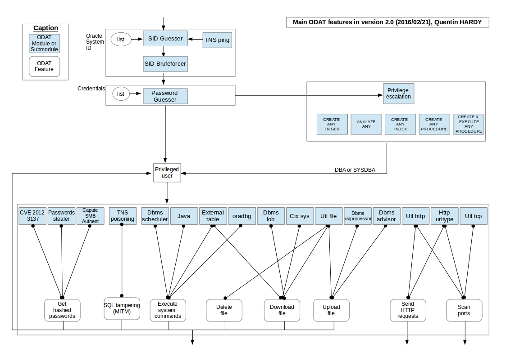

| __Quentin HARDY__    |
| ------------- |
| __quentin.hardy@protonmail.com__  |
| __quentin.hardy@bt.com__    |


ODAT 
====

__ODAT__ (Oracle Database Attacking Tool) is an open source __penetration testing__ tool that tests the security of __Oracle Databases remotely__.

Usage examples of ODAT:
* You have an Oracle database listening remotely and want to find valid __SIDs__ and __credentials__ in order to connect to the database
* You have a valid Oracle account on a database and want to __escalate your privileges__ to become DBA or SYSDBA
* You have a Oracle account and you want to __execute system commands__ (e.g. __reverse shell__) in order to move forward on the operating system hosting the database

Tested on Oracle Database __10g__,  __11g__,  __12c__ and __18c__.

__ODAT linux standalone__ version at [https://github.com/quentinhardy/odat/releases/](https://github.com/quentinhardy/odat/releases/). Notice it is recommended to use the development version (*git clone*).
~~(__Deprecated at this time__)~~

Changelog
====
* Version __3.0__ (__01/09/2019__):
  * Compatible with Oracle Database 18c
  * New option in Java module for setting the path to shell (e.g. /usr/bin/sh when CentOS)
* Version __2.3.2__ (__16/07/2019__):
  * Bug fixes:
    * external table and false negative
* Version __2.3.1__ (__10/08/2018__):
  * New option in Java module for exploiting CVE-2018-3004: It allows an authenticated user to arbitrarily write to files on the OS (Privilege escalation with bypass built in Oracle JVM security). More details [http://obtruse.syfrtext.com/2018/07/oracle-privilege-escalation-via.html](http://obtruse.syfrtext.com/2018/07/oracle-privilege-escalation-via.html). 
* Version __2.3__ (__06/03/2018__):
  * Bug fixes:
    * Some database credentials could not be detected in passwordguesser module (when it tries to connect as SYSDBA/SYSOPER before). Important bug fix!
    * PPoutput missing in smb module (thx to dirkjanm)
    * False positive in tnspoison module
    * Sometimes, impossible to get version from VSNNUM
  * Improvements:
    * Performence improvements when you bruteforce accounts.
    * Option for connection with a TNS Connection String
    * New trivial credentials in accounts file
    * Better read file method in dbmsLob module (thx to omair2084)
* Version __2.2.1__ (__12/04/2017__):
  * Bug fixes: 
    * Version in tnscmd ([info](https://github.com/quentinhardy/odat/commit/9b7ec57cfed0fe74381edff28b73532562acaa2c))
    * External module (Catch an Oracle error)
    * Catch error when "connection to server failed"
    * Tnscmd: "The server SID must be given with the '-d SID' option
    * TypeError Bug Fix in tnspoison module
    * TNS poisoning module when port!=1521 (Integer bug) 
  * Improvements:
    * New SIDs
* Version __2.2__ (__25/03/2016__):
  * A new module (_tnspoison_) for exploiting the TNS listener poisoning attack (CVE-2012-1675). Big thanks to [Joxean Koret](http://seclists.org/fulldisclosure/2012/Apr/204) and [donctl](https://github.com/donctl).
  * Some bug fixes
  * Better help menu
  * [__WIKI__ pages](https://github.com/quentinhardy/odat/wiki) in the ODAT repository
* Version __2.1__ (__04/03/2016__) :
  * A new module (_cve_) for exploiting some CVE (Common Vulnerabilities and Exposures). CVE-2012-3137 (perhaps this number, I'm not sure...) implemented at the moment: A user authenticated can modify all tables who can select even if he can't modify them normally (no ALTER privilege).
  * new option (__--accounts-files__) for remote authentication attack which uses 2 distinct files: a login list and password list.
  * Print 10g passwords for oclHashcat compatibility.
  * bug fixes (listening with __nc__).
* Version __2.0__ (__21/02/2016__) :
  * A new module (_privesc_) for using system privileges of an Oracle user (e.g. CREATE ANY PROCEDURE) in order to gain privileged access (i.e. DBA). System privileges that can be used by ODAT in this version:
    * CREATE ANY PROCEDURE: execution of arbitrary requests with APEX_040200's privileges (e.g. modification of Oracle users' passwords)
    * CREATE PROCEDURE and EXECUTE ANY PROCEDURE: execution of arbitrary requests as SYS (e.g. gives DBA role to a user)
    * CREATE ANY TRIGER (and CREATE PROCEDURE): execution of arbitrary requests as SYS (e.g. gives DBA role to a user)
    * ANALYZE ANY (and CREATE PROCEDURE): execution of arbitrary requests as SYS (e.g. gives DBA role to a user)
    * CREATE ANY INDEX (and CREATE PROCEDURE): execution of arbitrary requests as SYS (e.g. gives DBA role to a user)
  * The module _privesc_ can be used to get all system privileges and roles granted. It shows system privileges that can be used to gain privileged access.
  * new option (-vvv) for showing SQL requests sent by ODAT in debugs
  * standalone version moved to *releases* ([https://github.com/quentinhardy/odat/releases/](https://github.com/quentinhardy/odat/releases/))
* Version __1.6__ (__14/07/2015__) :
  * new feature to detect if a target is vulnerable to TNS poisoning (CVE-2012-1675)
  * new module named *unwrapper* to unwrap PL/SQL source code wrapped, from a file or a remote database
  * some improvements done
* Version __1.5__ (__17/03/2015__) :
  * new module named *search* in order to search in column names
  * some improvements done (ex: output of tables)
  * new option : output encoding
* Version __1.4__ (__07/12/2014__) :
  * fix some false positives
  * improve the CVE-2012-3137 module: check more easily if the vulnerability can be exploited
* Version __1.3__ (__07/10/2014__) : 
  * add the *-C* option in the *all* module. This module can be used to use file which contains credentials (disable the *-U* and *-P* option)
  * add the *tnscmd* module to get TNS *alias*, database *version* (thanks to VSNNUM) and TNS *status*
  * bug fix: name server can be given to the *-s* option
* Version __1.2__ (__08/08/2014__) : 
  * add the *SMB* module to capture a SMB authentication
  * add an option (*SHOW_SQL_REQUESTS_IN_VERBOSE_MODE*) in *Constants.py* to show SQL requests sent to the database server
* Version __1.1__ (__28/07/2014__) : 
  * add the *DBMS_LOB* module useful in order to download files stored on a remote server through Oracle Database.
  * bug fix: java source code: "getenv no longer supported, use properties and -D instead"
* Version __1.0__ (__26/06/2014__) : 
  * first ODAT version.

Features
====

Thanks to ODAT, you can:

* search __valid SID__ on a remote Oracle Database listener via:
  * a dictionary attack
  * a brute force attack
  * ALIAS of the listener
* search Oracle __accounts__ using:
  * a dictionary attack
  * each Oracle user like the password (need an account before to use this attack)
* __execute system commands__ on the database server using:
  * DBMS_SCHEDULER
  * JAVA
  * external tables
  * oradbg
* __download files__ stored on the database server using:
  * UTL_FILE
  * external tables
  * CTXSYS
  * DBMS_LOB
* __upload files__ on the database server using:
  * UTL_FILE
  * DBMS_XSLPROCESSOR
  * DBMS_ADVISOR
* __delete files__ using:
  * UTL_FILE
* __gain privileged access__ using these following system privileges combinations (see help for *privesc* module commands): (__NEW__ : 2016/02/21)
  * CREATE ANY PROCEDURE
  * CREATE PROCEDURE and EXECUTE ANY PROCEDURE
  * CREATE ANY TRIGER (and CREATE PROCEDURE)
  * ANALYZE ANY (and CREATE PROCEDURE)
  * CREATE ANY INDEX (and CREATE PROCEDURE)
* __send/reveive HTTP requests__ from the database server using:
  * UTL_HTTP
  * HttpUriType
* __scan ports__ of the local server or a remote server using:
  * UTL_HTTP
  * HttpUriType
  * UTL_TCP
* __capture a SMB authentication__ through:
  * an index in order trigger a SMB connection
* exploit some CVE: 
  * the [__CVE-2012-3137__](http://cvedetails.com/cve/2012-3137)
      * pickup the session key and salt for arbitrary users
      * attack by dictionary on sessions
  * the [__CVE-2012-????__](https://twitter.com/gokhanatil/status/595853921479991297): A user authenticated can modify all tables who can select even if he can't modify them normally (no ALTER privilege). 
  * the [__CVE-2012-1675__](http://seclists.org/fulldisclosure/2012/Apr/204) (aka TNS poisoning attack) (__NEW__ : 25/03/2016)
* __search in column names__ thanks to the *search* module:
  * search a pattern (ex: password) in column names
* __unwrap__ PL/SQL source code (10g/11g and 12c)
* get __system privileges__ and __roles granted__. It is possible to get privileges and roles of roles granted also (__NEW__ : 21/02/2016)



Supported Platforms and dependencies
====

ODAT is compatible with __Linux__ only.

__Standalone versions__ exist in order to don't have need to install dependencies and slqplus (see [https://github.com/quentinhardy/odat/releases/](https://github.com/quentinhardy/odat/releases/)).
The ODAT standalone has been generated thanks to *pyinstaller*.

If you want to have the __development version__ installed on your computer, these following tools and dependencies are needed:
* Langage: Python 2.7 & Python 3
* Oracle dependancies: 
  * Instant Oracle basic
  * Instant Oracle sdk
* Python libraries: 
  * cx_Oracle
  * passlib
  * pycrypto
  * python-scapy
  * colorlog (recommended)
  * termcolor (recommended)
  * argcomplete (recommended)
  * pyinstaller (recommended)

Installation (optional, for development version)
====

This part describes how to install instantclient, CX_Oracle and some others python libraries on __Ubuntu__ in order to have the ODAT development version. 
Don't forget that an ODAT standalone version exists at [https://github.com/quentinhardy/odat/releases/](https://github.com/quentinhardy/odat/releases/): __It is not required to install something for use the standalone version__

* Clone the repository to get the ODAT source code:
```bash
git clone https://github.com/quentinhardy/odat.git
```

* Update wiki pages in this repository for getting the ODAT documentation locally:
```bash
cd odat/
git submodule init
git submodule update
```

* Get instant client basic, sdk (devel) and sqlplus from the Oracle web site:
  * X64: http://www.oracle.com/technetwork/topics/linuxx86-64soft-092277.html
  * X86: http://www.oracle.com/technetwork/topics/linuxsoft-082809.html

* Install *python-dev*, *alien* and *libaio1* package (for sqlplus):
```bash
sudo apt-get install libaio1 python-dev alien python-pip
```

* Generate DEB files from RPM files with :
```bash
sudo alien --to-deb oracle-instantclient19.3-basic-???.x???.rpm
sudo alien --to-deb oracle-instantclient19.3-devel-???.x???.rpm
```

* Install instant client basic, sdk and sqlplus:
```bash
sudo dpkg -i oracle-instantclient19.3-basic-???.x???.deb
sudo dpkg -i oracle-instantclient19.3-devel_???_???.deb
```

* Put these lines in your */etc/profile* file in order to define Oracle *env* variables:
```bash
export ORACLE_HOME=/usr/lib/oracle/19.3/client64/
export LD_LIBRARY_PATH=$LD_LIBRARY_PATH:$ORACLE_HOME/lib
export PATH=$ORACLE_HOME/bin:$PATH
```

* Restart your session (to apply env variables)

* Create the */etc/ld.so.conf.d/oracle.conf* file and add the path to Oracle home:
```
/usr/lib/oracle/19.3/client64/lib/
```

* Update the ldpath using:
```bash
sudo ldconfig
```

* Install *CX_Oracle*
```bash
sudo -s
source /etc/profile
pip install cx_Oracle
```

* Test if all is good:
```bash
python -c 'import cx_Oracle' 
```
> This command should *just return* without errors.

* Install some python libraries:
```bash
sudo apt-get install python-scapy
sudo pip install colorlog termcolor pycrypto passlib
sudo pip install argcomplete && sudo activate-global-python-argcomplete
```

* Install the __development__ version of pyinstaller (http://www.pyinstaller.org/).
```bash
python setup.py install
```

* Run ODAT:
```bash
./odat.py -h
```

> __Good job if you have not errors:)__

Docs and examples
====

Docs and examples are on the [__WIKI__](https://github.com/quentinhardy/odat/wiki) 


Donation
====
If you want to support my work doing a donation, I will appreciate a lot:

* Via BTC: 36FugL6SnFrFfbVXRPcJATK9GsXEY6mJbf
